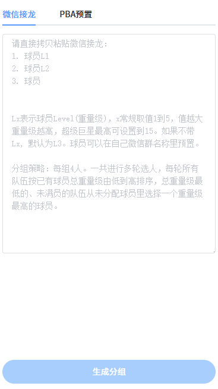

# 篮球组队 (Teamup)

这是一个简单的篮球组队工具，旨在通过平衡球队的总“重量级”（Level）来快速、公平地进行分组，均衡野球场各队的实力。支持从微信接龙信息直接解析球员列表，并根据球员水平进行智能分配。

## 主要功能

- **微信接龙解析**：直接复制粘贴微信群里的接龙信息，自动识别球员及其等级。
- **智能分组算法**：基于球员等级（L1-L15）进行多轮选人，确保每支队伍的综合实力相对均衡。
- **自定义等级**：支持 L1 到 L5 的常规等级，超级巨星最高可设置到 L15。
- **响应式设计**：主要适用手机浏览器，方便在球场边即时操作。

## 预览

  <kbd>
    
  </kbd>

## 如何使用

### 1. 微信接龙模式
1. 将微信群里的接龙文本（例如：`1. 张三L4`）复制到“微信接龙”输入框中。
2. 格式说明：`球员名Lx`。`x` 代表等级（1-5 为常规，最高 15）。若未标注等级，默认识为 `L3`。
3. 系统会自动解析出球员数量。
4. 点击“生成分组”即可得到结果。

### 2. 分组策略
每组固定 4 人。系统会进行多轮选人：
- 每轮开始前，根据各队已分配球员的总重量级由低到高排序。
- 总重量级最低的队伍（且未满员）优先从剩余球员池中选择当前重量级最高的球员。

